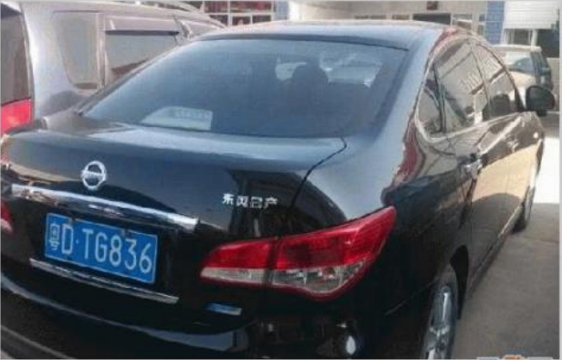
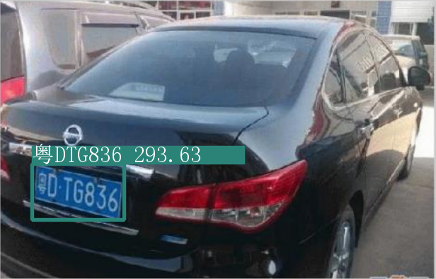

# 车牌识别

## 原理
- YOLOv5：车牌定位
- LPRNet：车牌识别

## 使用方法

|  参数   | 说明  | 默认 |
|  ----  | ----  | --- |
| --source  | 照片文件夹路径 | ./inference/images/ |
| --output        | 保存结果路径 | ./inference/output |
| --conf-thres      | object confidence threshold | 0.4 |
| --iou-thres  | IOU threshold for NMS | 0.5 |
| --view-img        | 显示结果 | false |
| --save-txt      | 保存结果为txt | false |
| --augment     | augmented inference | false |

默认
```bash
python ./main.py
```

保存识别结果为txt
```bash
python ./main.py --save-txt
```

显示识别结果
```bash
python ./main.py --view-img
```

自定义输入与输出
```bash
python ./main.py --source ../car --output ./output
```
---
`识别效果`





## 关于YOLOv5的训练

[数据集参数](./yolov5/data/plat.yaml)
```yaml
train: /data/CCPD2020/images/train/  # 16551 images
val: /data/CCPD2020/images/val/  # 4952 images

# number of classes
nc: 1

# class names
names: [ 'plate']
```
model: `yolov5s `

[train.py的超参数](./yolov5/train.py)
```python
    parser = argparse.ArgumentParser()
    parser.add_argument('--weights', type=str, default='./weights/yolov5s.pt', help='initial weights path')
    parser.add_argument('--cfg', type=str, default='models/yolov5s.yaml', help='model.yaml path')
    parser.add_argument('--data', type=str, default='data/plat.yaml', help='data.yaml path')
    parser.add_argument('--hyp', type=str, default='data/hyp.scratch.yaml', help='hyperparameters path')
    parser.add_argument('--epochs', type=int, default=300)
    parser.add_argument('--batch-size', type=int, default=8, help='total batch size for all GPUs')
    parser.add_argument('--img-size', nargs='+', type=int, default=[640, 640], help='[train, test] image sizes')
    parser.add_argument('--rect', action='store_true', help='rectangular training')
    parser.add_argument('--resume', nargs='?', const=True, default=False, help='resume most recent training')
    parser.add_argument('--nosave', action='store_true', help='only save final checkpoint')
    parser.add_argument('--notest', action='store_true', help='only test final epoch')
    parser.add_argument('--noautoanchor', action='store_true', help='disable autoanchor check')
    parser.add_argument('--evolve', action='store_true', help='evolve hyperparameters')
    parser.add_argument('--bucket', type=str, default='', help='gsutil bucket')
    parser.add_argument('--cache-images', action='store_true', help='cache images for faster training')
    parser.add_argument('--image-weights', action='store_true', help='use weighted image selection for training')
    parser.add_argument('--device', default='', help='cuda device, i.e. 0 or 0,1,2,3 or cpu')
    parser.add_argument('--multi-scale', action='store_true', help='vary img-size +/- 50%%')
    parser.add_argument('--single-cls', action='store_true', help='train multi-class data as single-class')
    parser.add_argument('--adam', action='store_true', help='use torch.optim.Adam() optimizer')
    parser.add_argument('--sync-bn', action='store_true', help='use SyncBatchNorm, only available in DDP mode')
    parser.add_argument('--local_rank', type=int, default=-1, help='DDP parameter, do not modify')
    parser.add_argument('--workers', type=int, default=4, help='maximum number of dataloader workers')
    parser.add_argument('--project', default='runs/train', help='save to project/name')
    parser.add_argument('--entity', default=None, help='W&B entity')
    parser.add_argument('--name', default='exp', help='save to project/name')
    parser.add_argument('--exist-ok', action='store_true', help='existing project/name ok, do not increment')
    parser.add_argument('--quad', action='store_true', help='quad dataloader')
    parser.add_argument('--linear-lr', action='store_true', help='linear LR')
    parser.add_argument('--label-smoothing', type=float, default=0.0, help='Label smoothing epsilon')
    parser.add_argument('--upload_dataset', action='store_true', help='Upload dataset as W&B artifact table')
    parser.add_argument('--bbox_interval', type=int, default=-1, help='Set bounding-box image logging interval for W&B')
    parser.add_argument('--save_period', type=int, default=-1, help='Log model after every "save_period" epoch')
    parser.add_argument('--artifact_alias', type=str, default="latest", help='version of dataset artifact to be used')
```

## LPRNet
- 训练教程请看[tutorial.ipynb](./LPRNet/tutorial.ipynb)，数据集使用`chinese_license_plate_generator`生成的，或者使用CCPD2020经YOLOv5剪切出来的车牌。
- 使用预训练好的模型去再训练，记得要把dropout关闭，可参考[demo.ipynb](./LPRNet/demo.ipynb)

## 引用的代码来源
- [yolov5](https://github.com/ultralytics/yolov5)
- [LPRNet](https://github.com/sirius-ai/LPRNet_Pytorch)
- [chinese_license_plate_generator](https://gitee.com/leijd/chinese_license_plate_generator)
