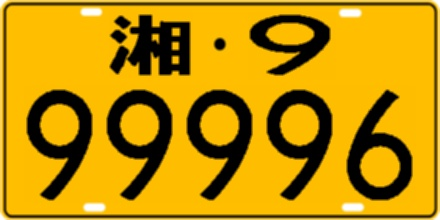
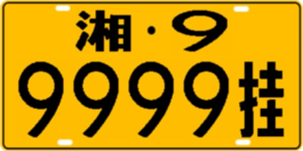

# 中国车牌模拟生成器

#### 介绍
中国车牌模拟生成器

#### 支持车牌
黄色、白色、黑色、新能源车牌

单层、双层车牌


#### 安装教程

- python >= 3.5
- opencv-python >= 3.4
- numpy >= 1.15


windows下的字符问题见：https://gitee.com/leijd/chinese_license_plate_generator/issues/I1NOC7

#### 使用说明

1、随机生成车牌

随机生成车牌图片并保存，一般用于大批量生成数据集

```
python generate_multi_plate.py --number 10 --save-adr multi_val
```

2、生成指定车牌

```
# 黄色双层车牌-湘999999
python generate_special_plate.py --plate-number 湘999999 --bg-color yellow --double
```

|  参数   | 说明  |
|  ----  | ----  |
| plate-number  | 车牌号码 |
| double        | 是否双层车牌 |
| bg-color      | 底板颜色|


目前支持的底板颜色（bg-color）有：
|  参数   | 说明  |
|  ----  | ----  |
| black | 粤港澳 |
| black_shi | 使领馆 |
| blue | 普通轿车（仅支持单层7位） |
| green_car | 新能源轿车（仅支持单层8位） |
| green_truck | 新能源卡车（仅支持单层8位） |
| white | 白色警车 |
| white_army | 白色军车（仅支持单层7位） |
| yellow | 中型车 |


请设置符合交通法的车牌，否则报错。比如新能源车牌（green_car/green_truck）都是8位，没有7位。


项目说明见：https://zhuanlan.zhihu.com/p/101352235


3、各类型车牌命令示例

- 蓝色单层7位

  ```
  python generate_special_plate.py --plate-number 湘999999 --bg-color blue
  ```

  

  

- 新能源单层8位-轿车

  ```
  python generate_special_plate.py --plate-number 湘9999999 --bg-color green_car
  ```

  

- 新能源单层8位-卡车

  ```
  python generate_special_plate.py --plate-number 湘9999998 --bg-color green_truck
  ```

  

- 白色单层7位

  ```
  python generate_special_plate.py --plate-number 湘99999警 --bg-color white
  ```

  

- 黄色单层7位

  ```
  python generate_special_plate.py --plate-number 湘999997 --bg-color yellow
  ```

  

- 黄色双层7位

  ```
  python generate_special_plate.py --plate-number 湘999996 --bg-color yellow --double
  ```

  
  
  ```
  python generate_special_plate.py --plate-number 湘99999挂 --bg-color yellow --double
  ```
  

